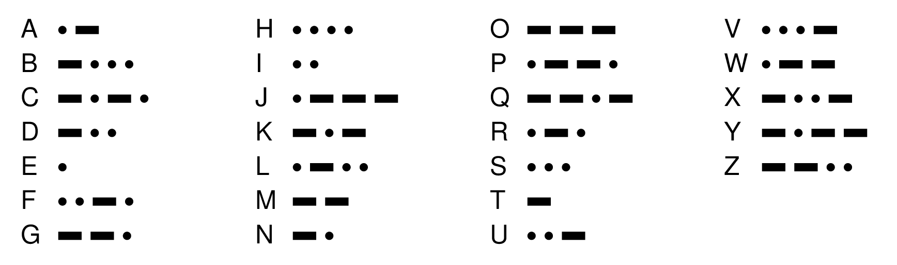

## Problem 1
- In Morse code, every letter is represented by a sequence of short pulses ("dots") or long pulses ("dashes") as shown in the following table:

{width=60%}

- The mapping from letters to Morse code is easy to represent as a Python dictionary in which the keys are the English letters and the values the corresponding string of dots and dashes, as shown on the next slide.


## A Python English to Morse Dictionary
```{.mypython style='max-height:900px; font-size:.8em'}
# File: MorseCodeDictionary.py

"""
This file defines a dictionary called LETTERS_TO_MORSE 
whose entries are the Morse code translations of the letters.
"""

# Constants 

LETTERS_TO_MORSE = {
   "A": ".-",
   "B": "-...",
   "C": "-.-.",
   "D": "-..",
   "E": ".",
   "F": "..-.",
   "G": "--.",
   "H": "....",
   "I": "..",
   "J": ".---",
   "K": "-.-",
   "L": ".-..",
   "M": "--",
   "N": "-.",
   "O": "---",
   "P": ".--.",
   "Q": "--.-",
   "R": ".-.",
   "S": "...",
   "T": "-",
   "U": "..-",
   "V": "...-",
   "W": ".--",
   "X": "-..-",
   "Y": "-.--",
   "Z": "--.."
}
```

## Your Mission
- In this problem, your job is to write a Python program that translates messages to Morse code.
- Your program should read in lines from the user and then translate each line into Morse code.
- Your program should continue prompting the user and translating until an empty line is entered
- A sample run of this program (taken from the messages between the Titanic and the Carpathia in 1912) might look like this:

  ```{.text style='font-size:.75em'}
  > SOS TITANIC
  ... --- ... - .. - .- -. .. -.-.
  > WE ARE SINKING FAST
  .-- . .- .-. . ... .. -. -.- .. -. --. ..-. .- ... -
  >
  ```

## `... --- .-.. ..- - .. --- -.`
```{.mypython style='max-height:900px; font-size:.75em;'}
# File: MorseCode.py

"""This program solves the MorseCode problem from section."""

from MorseCodeDictionary import LETTERS_TO_MORSE

def morse_code():
    """Translates lines to and from Morse code."""
    finished = False
    while not finished:
        line = input("> ")
        if line == "":
            finished = True;
        else:
            print(translate_letters_to_morse(line))

# Implementation note: translate_letters_to_morse
# -----------------------------------------------
# Translates a string of letters into Morse code characters separated
# by spaces.  Characters that don't appear in the table are ignored.

def translate_letters_to_morse(line):
    morse = ""
    for ch in line.upper():
        if ch in LETTERS_TO_MORSE:
            if morse != "":
                morse += " "
            morse += LETTERS_TO_MORSE[ch]
    return morse

# Startup code

if __name__ == "__main__":
    morse_code()
```


## Problem 2
- The primary computing story throughout most of 2023 and 2024 has revolved around generative AI and large-language models.
- While the underlying software for something like ChatGPT is much more complex, the core technology is based on a _large-language model_ (LLM) that scans a massive volume of text and then uses that data to create sentences in which new words are chosen based on the frequency in which they appear in the context of the words already generated.
- ChatGPT uses complex contextual information to predict the next word, but one can construct a much simpler language-generation model that uses only the previous word to guess what word comes next.


## Building the Model
- To build a simplified language model that uses a single word as the context, all you need to do is create a dictionary in which each key is a word that appears in your text (often called the _corpus_) and the corresponding value is a list of all the words that follow that key.
- To get a sense for how this process works, it helps to start with a small corpus, which might consist of the following three lines from Shakespeare's _Macbeth_:

  ```text
  Tomorrow, and tomorrow, and tomorrow
  Creeps in this petty pace from day to day
  To the last syllable of recorded time;
  ```
- The dictionary that serves as our model must show, for example, that the word `"tomorrow"` appears three times, twice followed by the word `"and"` and once followed by `"creeps"`.


## The "MacBeth" Language Model
- The complete dictionary would look like:
  ```mypython
  {
      "and": ["tomorrow", "tomorrow"],
      "creeps": ["in"],
      "day": ["to", "to"],
      "from": ["day"],
      "in": ["this"],
      "last": ["syllable"],
      "of": ["recorded"],
      "pace": ["from"],
      "petty": ["pace"],
      "recorded": ["time"],
      "syllable": ["of"],
      "the": ["last"],
      "this": ["petty"],
      "time": [],
      "to": ["day", "the"],
      "tomorrow": ["and", "and", "creeps"]
  }
  ```

## Token Building
- To build such a dictionary, you need to select off one word at a time from your corpus, appending it to the correct list in your dictionary.
- This is an excellent time to make use of the TokenScanner library and class!
- Remember that to do so you need to initialize the TokenScanner, and then iterate through as long as their remain tokens, retrieving each as you go.
- Write a function called `create_model(text)` which uses the TokenScanner library to parse the provided text to create a simple dictionary language model, as shown on the previous slide.


## Token Solution
```{.mypython style='max-height: 900px; font-size:.9em'}
def create_model(text):
    """Returns the language-model dictionary 
    for the provided text."""
    scanner = TokenScanner(text)
    model = { }
    previous = None
    while scanner.has_more_tokens():
        word = scanner.next_token().lower()
        if word.isalpha():
            if word not in model:
                model[word] = [ ]
            if previous is not None:
                model[previous].append(word)
            previous = word
    return model
```

## Problem 3
- Piggybacking off your success in Problem 2, your next task is to implement the function:

  ```mypython
  generate_text(model, start, max_words)
  ```
  where:
  
  - `model` is the dictionary created from Problem 2
  - `start` is the first word of the generated text
  - `max_words` is the maximum number of words to generate (though the process may end sooner if a word is encountered that has no valid subsequent words)
- Your function should return a string, which is built up by randomly selecting the next word from the dictionary given the current word


## MacBeth Generation
- With a simple model such as the three line selection from _MacBeth_, the function doesn't have a great deal of choice, but there is still some flexibility.
- Given the starting word `"tomorrow"`, `generate_text` could return the original Shakespeare line, but it could also repeat `"and tomorrow"` or `"to day"` any number of times.
- Example:
  ```text
  tomorrow and tomorrow and tomorrow creeps in this petty pace from day to day to day to day to day to the last syllable of recorded time 
  ```

## Possible Solution
```mypython
def generate_text(model, start, max_words=100):
    sentence = start
    current = start
    while (len(sentence) <= max_words and 
           len(model[current]) > 0):
        next_word = random.choice(model[current])
        sentence += " " + next_word
        current = next_word
    return sentence.capitalize() + "."
```

## Beyond
- What might you do to further improve the quality of the text your program generates?
   - Building up a larger-corpus
   - Looking at more than just the preceding word: maybe looking at the last three words
   - Otherwise accounting for the current context of the generated sentence
- In the repository there are some larger blocks of text that you could read in and build corpuses from!
